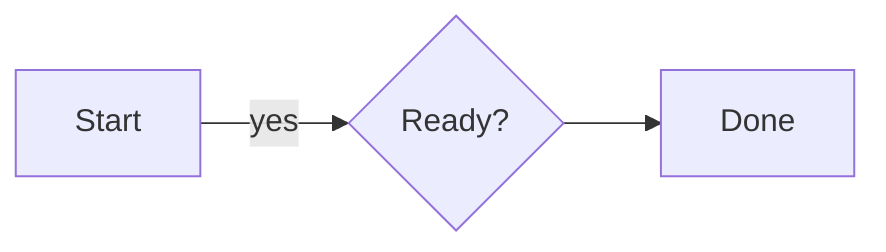

# Flowchart syntax

**Headers:** `graph`, `flowchart`, `flowchart-v2`, or `flowchart-elk`,
followed by `TB`, `TD`, `BT`, `LR`, or `RL`.

**Nodes:** `A`, `A[text]`, `A(text)`, `A([text])`, `A[[text]]`,
`A((text))`, `A(((text)))`, `A{text}`, `A{{text}}`, `A[(text)]`,
`A>text]`, `A[/text/]`, `A[\text\]`, `A[/text\]`,
`A[\text/]`, and `A@{ shape: diamond }`. Shape names also include
`rect`, `rounded`, `hex`, `circle`, `stadium`, `cyl`, and
`subproc`. Labels also accept ` ` and
HTML entities.

**Links and groups:** `-->`, `---`, `-.->`, `==>`, `~~~`, longer
variants, `-->|label|`, chains, and `&` groups. Use `subgraph ...` /
`end` to create a frame; `direction` sets its orientation.

`style`, `classDef`, `class`, `linkStyle`, and `:::` accept hex
`fill`, `stroke`, and `color` values for ANSI output. `click` is ignored
with an informational diagnostic. Unknown statements produce errors while
valid statements continue to render.
