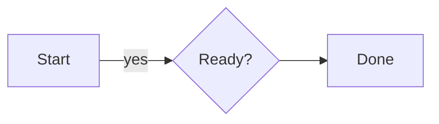

# Flowchart syntax

Headers: `graph`, `flowchart`, `flowchart-v2`, or `flowchart-elk`, followed by
`TB`, `TD`, `BT`, `LR`, or `RL`.

Nodes: `A`, `A[text]`, `A(text)`, `A([text])`, `A[[text]]`, `A((text))`, `A(((text)))`, `A{text}`, `A{{text}}`, `A[(text)]`, `A>text]`, `A[/text/]`, `A[/text\]`, and `A@{ shape: diamond }`. ` ` and HTML entities in labels are accepted.

Edges: `-->`, `---`, `-.->`, `==>`, `~~~`, longer variants, edge labels `-->|text|`, chains, and `&` groups. `subgraph ...` / `end` creates a frame. `direction` changes the top level orientation.

`style`, `classDef`, `class`, `linkStyle`, and `:::` accept `fill`, `stroke`, and `color` hex values for ANSI output. `click` produces an information diagnostic and is ignored. Unknown statements produce errors, and valid statements continue rendering.
