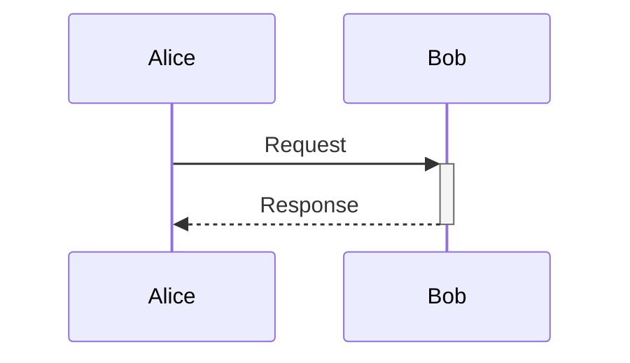

# Sequence syntax

`sequenceDiagram` accepts `participant` and `actor` declarations, optional `as` labels, message operators `->`, `-->`, `->>`, `-->>`, `-x`, `--x`, `-)`, and `--)`, self messages, `Note left of` / `right of` / `over`, `activate`, `deactivate`, and `autonumber`. `+` or `-` before the recipient activates or deactivates a participant. `loop`, `alt` / `else`, `opt`, `par` / `and`, `critical`, `break`, and `rect` create frames.

Unsupported statements produce errors. Participant declaration order determines columns; undeclared participants use first appearance order.
Pass `repeat_participants: true` to `render` to show participant boxes again at the bottom.
