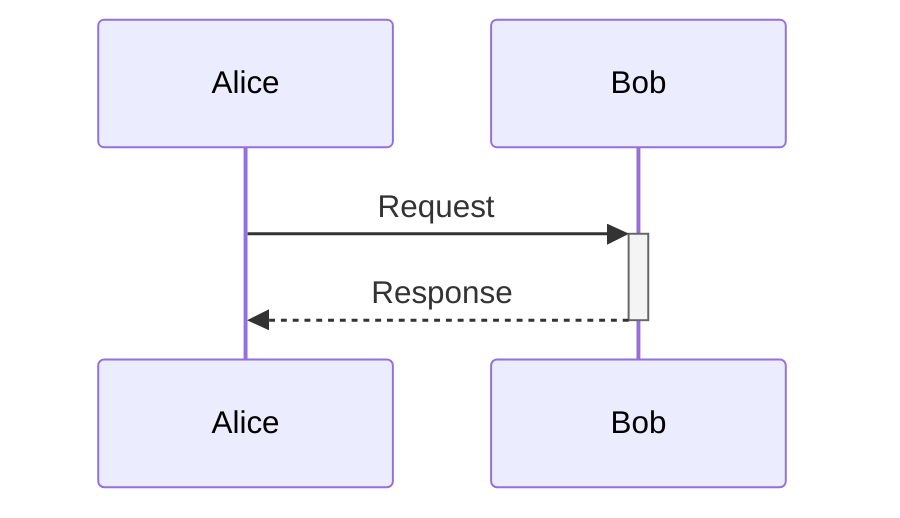

# Sequence syntax

- **Participants:** declare `participant` or `actor`; use `as` for a display
  label. Undeclared participants are added when first used.
- **Messages:** `->`, `-->`, `->>`, `-->>`, `-x`, `--x`, `-)`, and
  `--)`. A message can target its own participant.
- **Notes and activation:** `Note left of`, `right of`, or `over`;
  `activate`, `deactivate`, or `+` / `-` on the message recipient.
- **Frames:** `loop`, `alt` / `else`, `opt`, `par` / `and`,
  `critical`, `break`, and `rect`.
- **Options:** `autonumber` numbers messages. Pass
  `repeat_participants: true` to show participant boxes again at the bottom.

Unsupported statements produce errors.
